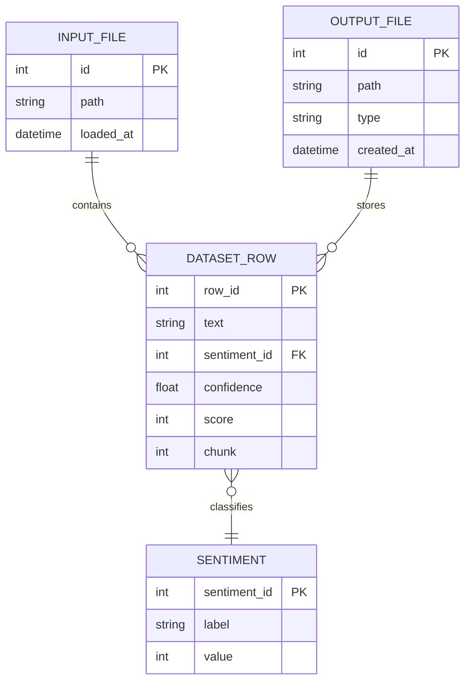

# SentimentAutomated ER Diagram

```mermaid
erDiagram
    INPUT_FILE ||--o{ DATASET_ROW : contains
    DATASET_ROW }o--|| SENTIMENT : classifies
    OUTPUT_FILE ||--o{ DATASET_ROW : stores

    INPUT_FILE {
        int id PK
        string path
        datetime loaded_at
    }

    DATASET_ROW {
        int row_id PK
        string text
        int sentiment_id FK
        float confidence
        int score
        int chunk
    }

    SENTIMENT {
        int sentiment_id PK
        string label
        int value
    }

    OUTPUT_FILE {
        int id PK
        string path
        string type
        datetime created_at
    }
```
